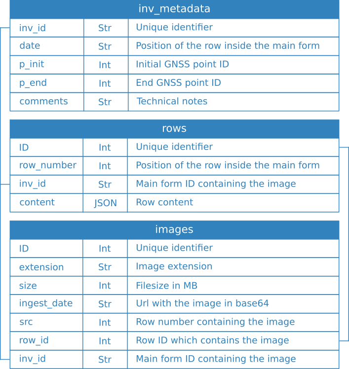

# inventario (development stage)
PWA (Progressive Web Application) to collect vegetation data at field.

[Link to the site](https://cristianics.github.io/inventario/)

## Indexed DB schema

## Upgraded version's pending tasks

1. Crear nuevo esquema para almacenar y actualizar las filas de la tabla (reducir código).
2. Add button to diselect all rows
3. Make style responsive to mobile devices
4. Store array buffer instead URLbase64
5. Add images inside a new folder 'images' inside the zip downloaded folder
6. Asegurarse de aplicar las recomendaciones del
[manual de buenas prácticas con la IDB](https://web.dev/indexeddb-best-practices/)